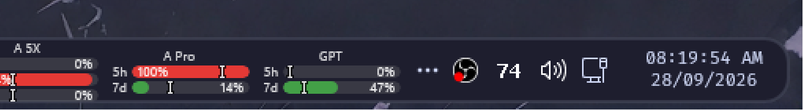

# David's Windhawk mods

A complete snapshot of my [Windhawk](https://windhawk.net) setup on Windows 11:
every mod I run, the exact settings, and the local mods I maintain, packaged so
the whole setup can be copied onto another machine. Snapshot refreshed 2026-10-03
on Windows 11 build 26200 with Windhawk 1.7.3.



The tray overflow chevron replaced with the three-dot "More" glyph that the
RosePine taskbar theme uses, with the taskbar-ai-quota-opencode bars next to
it. Before: [media/tray-before.png](media/tray-before.png).

## Layout

| Path | What it is |
| --- | --- |
| `mods/catalog/` | Copies of the [catalog mods](https://windhawk.net/mods) I run, one `.wh.cpp` each, as installed. Authors, versions and licenses in [mods/catalog/README.md](mods/catalog/README.md). |
| `mods/local/` | My mods, listed below. |
| `settings/` | Per-mod state and values, app and engine preferences, the quota mods' config, and a snapshot of the installed set. Details in [settings/README.md](settings/README.md). |
| `themes/` | Styler themes I made, ready to paste into Textual mode. |
| `mod-storage/` | Files mods wrote. Currently the Taskbar Styler images. |
| `editor/` | The Windhawk mod editor's settings. |
| `manifest.json` | Every mod with version, author, license, origin, enabled state, and source path. |
| `tools/` | Scripts to apply this snapshot to a machine or rebuild it from a live one. |
| `media/` | Screenshots. |

## Quick start

1. Install [Windhawk](https://windhawk.net) (this snapshot was made on 1.7.3).
2. Install the catalog mods. Search for each name from
   [mods/catalog/README.md](mods/catalog/README.md) in Windhawk and install it.
3. Install the local mods from `mods/local/` by pasting them into the Windhawk
   mod editor and compiling, or see [mods/README.md](mods/README.md) for the
   command-line build.
4. Apply the settings from an elevated shell (repo root as the working
   directory):

   ```powershell
   powershell -ExecutionPolicy Bypass -File tools\Apply-WindhawkSettings.ps1
   ```

   Add `-IncludeAppSettings` to also import the app and engine `.reg` files,
   and `-RestartEngine` to restart Windhawk when it finishes. Run with `-Audit`
   first to see what would change; audit writes nothing.
5. Copy `mod-storage/` over
   `C:\ProgramData\Windhawk\Engine\ModsWritable\mod-storage\`, and copy
   `editor/settings.json` over
   `C:\ProgramData\Windhawk\UIData\user-data\User\settings.json`.

Mod DLLs are not included. Windhawk compiles mods on your machine, so the
engine keeps using its own compiled file names.

## Keeping this current

After changing mods or settings, run `tools\Build-Repo.ps1` from the repo root.
It refreshes the catalog copies, the local mod files, `manifest.json`, the
catalog table, and the settings exports from the live install. Add
`-SkipSources` to refresh settings and metadata only.

## Taskbar weather

[Independent Taskbar Weather](mods/local/taskbar-weather) adds automatically updated weather and a readable rounded hover card. [Taskbar System Info with Weather](mods/local/taskbar-system-info-weather) follows it with a six-DIP gap. Installation and location setup are documented in each folder; published settings contain no saved town or coordinates.

## Start menu theme

[OnlySearch Mocha](themes/start-menu-onlysearch-mocha) cuts the redesigned
Windows 11 Start menu down to the search box and a power row. It combines the
OnlySearch and RosePine styler themes and recolors them with Catppuccin Mocha
and a blue accent. Paste [onlysearch-mocha.yaml](themes/start-menu-onlysearch-mocha/onlysearch-mocha.yaml)
into the Start Menu Styler's Textual mode.

## David's Audio Visualizer

[David's Audio Visualizer](mods/local/davids-audio-visualizer) draws a Mocha audio
spectrum and media controls beside the taskbar widgets. It captures active
Windows outputs and optional hardware loopbacks, including interface ASIO mixes
when the driver exposes them. Native taskbar events keep the strip positioned;
fullscreen and borderless windows hide it by default, and taskbar clicks pass
through its bar window. The mod has 49 documented
settings and a self-contained Windhawk source file.

## My mods

### david-window-pack

[David's Window Pack](mods/local/david-window-pack) combines AltSnap dragging,
Snap Commander and monitor movement. Its elevated keyboard helper can move
administrator windows, including Task Scheduler and Windhawk's own UI. The
combined settings page controls shortcuts, screen gaps and monitor targets.
GPL-3.0. Disable the three separate mods before enabling the pack.

### explorer-font-changer-davidhifi

[Explorer Font Changer by DavidHiFi](mods/local/explorer-font-changer-davidhifi)
changes Windows shell text while preserving icon fonts and emoji. It fixes
the original mod's selected-font lifetime bug and adds GDI, themed text, and
DirectWrite layout coverage. FiraCode Nerd Font is the default. The original
Explorer Font Changer must be disabled while this fork is enabled.

### alt-snap-drag

AltDrag window dragging plus the AltSnap gestures I use. Hold Alt and:

| Gesture | Action |
| --- | --- |
| left drag | move the window |
| right drag | resize from the edge or corner nearest the start of the drag |
| F | toggle maximize |
| M | minimize |
| Shift+Q | close |
| middle click | window menu |
| right click while moving | toggle the maximized state, which stays toggled |

A fork of [m417z's AltDrag](https://windhawk.net/mods/alt-drag), extended with
my [AltSnap](https://github.com/RamonUnch/AltSnap) shortcuts and gestures.
GPL-3.0, like the original.

### taskbar-ai-quota-opencode

Cleroth's [Taskbar AI Quota Bars](https://windhawk.net/mods/taskbar-ai-quota)
with an OpenCode Go provider added. MIT.

### npp-taskdlg-textcolor

Notepad++ dark mode paints the Save and confirm dialogs dark but leaves the
text black. This fixes the text inside `notepad++.exe` only. MIT.

### translucent-flyouts

A self-contained port of
[ALTaleX531's TranslucentFlyouts](https://github.com/ALTaleX531/TranslucentFlyouts)
(the archived app) to a single Windhawk mod: acrylic, blur or transparent
backgrounds for Win32 context menus, menu-bar dropdowns, tooltips and dropdown
lists, with the original settings schema. No helper app, no registry bridge.
Runs in every process except a protected-chain exclude list. LGPL-3.0 with
attribution to the original author.

### better-volume-mixer-plus

[0Allu's Better Volume Mixer](https://windhawk.net/mods/better-volume-mixer)
with per-app device routing added. Right-click an app in the mixer and pick
**Output device** or **Input device** to move just that app to another device,
or back to Default. It changes the same per-app setting as EarTrumpet and the
Windows volume mixer, so it replaces EarTrumpet. MIT, like the original.

### center-titlebar-fork

A prototype fork of
[rounk-ctrl's Center Titlebar](https://windhawk.net/mods/center-titlebar) that
reworks title centering for current Windows 11 builds, where DWM renders the
caption text with DirectWrite instead of the old theme text API. The centering
happens in `CVisual::UpdateLayout`, so it stays correct across maximize and
restore. Not installed on this machine and not published upstream yet; the
source lives here for safekeeping. MIT.

## Licensing

My work in this repo is MIT, see [LICENSE](LICENSE). The catalog mods under
`mods/catalog/` are their authors' work and keep their own licenses, listed in
the catalog table where the source declares one. `alt-snap-drag` is GPL-3.0
because its upstream is, `david-window-pack` and `taskbar-system-info-weather` are GPL-3.0, and `translucent-flyouts` is LGPL-3.0 for the same
reason.

`settings/` holds configuration values only. The quota mods keep encrypted
account credentials in their own LocalStorage values, and none of that is
included here.
