# Windhawk mods

My [Windhawk](https://windhawk.net) mods for Windows 11, plus a full snapshot of
the setup they run in: every catalog mod, every setting and the themes, ready to
copy onto another machine.

## Mods

| | Mod | What it does |
| --- | --- | --- |
| 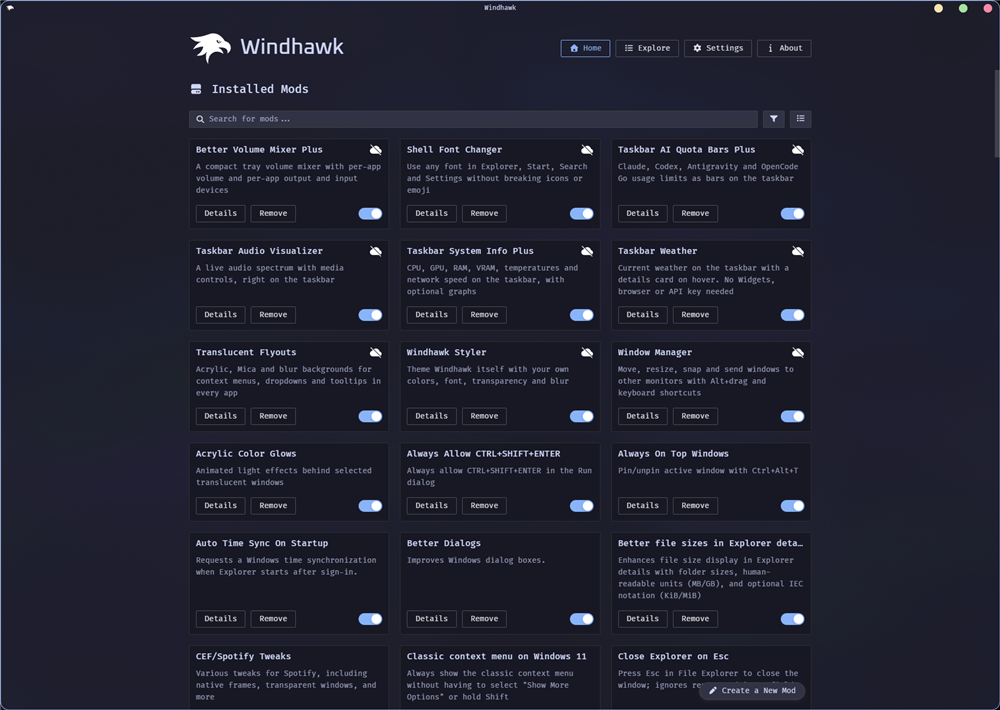 | [Windhawk Styler](mods/local/windhawk-styler) | Colors for backgrounds, cards and controls, fonts, background blur and title bar buttons that match your Windows theme. |
| 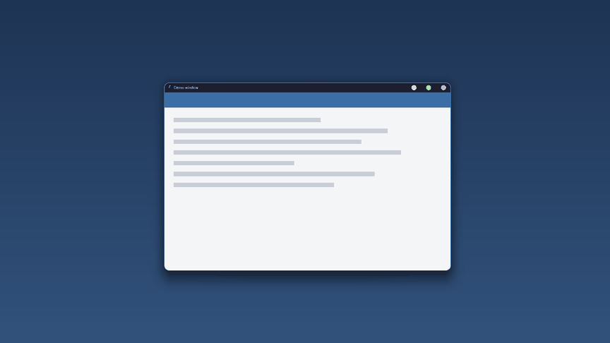 | [Window Manager](mods/local/window-manager) | Move, resize, snap and send windows to other monitors with Alt+drag and keyboard shortcuts. |
| 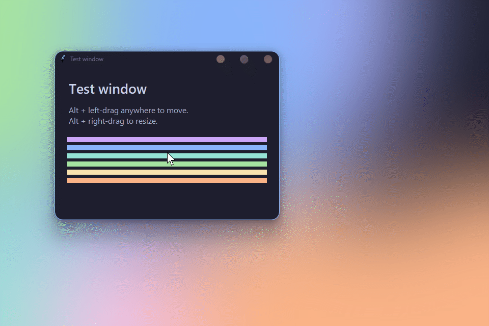 | [AltSnap](mods/local/alt-snap-drag) | Alt+drag to move and resize any window, plus AltSnap's window shortcuts. |
| 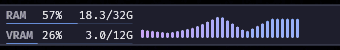 | [Taskbar Audio Visualizer](mods/local/taskbar-audio-visualizer) | A live audio spectrum with media controls, right on the taskbar. |
| 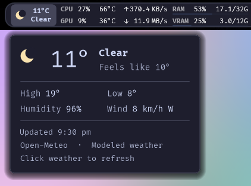 | [Taskbar Weather](mods/local/taskbar-weather) | Current weather on the taskbar with a details card on hover. No Widgets needed. |
| 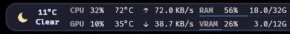 | [Taskbar System Info Plus](mods/local/taskbar-system-info-weather) | CPU, GPU, RAM, VRAM, temperatures and network speed on the taskbar. |
| 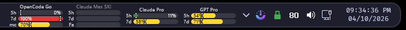 | [Taskbar AI Quota Bars Plus](mods/local/taskbar-ai-quota-opencode) | Claude, Codex, Antigravity and OpenCode Go usage limits as taskbar bars. |
| 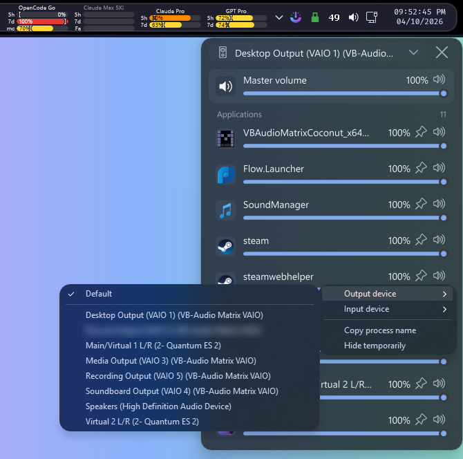 | [Better Volume Mixer Plus](mods/local/better-volume-mixer-plus) | A tray volume mixer with per-app volume and per-app output and input devices. |
| 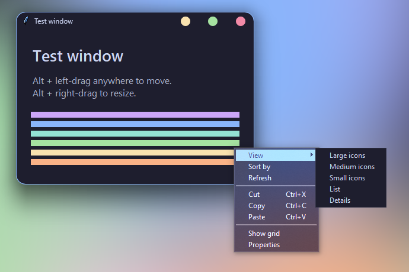 | [Translucent Flyouts](mods/local/translucent-flyouts) | Acrylic, Mica and blur backgrounds for menus, dropdowns and tooltips in every app. |
| 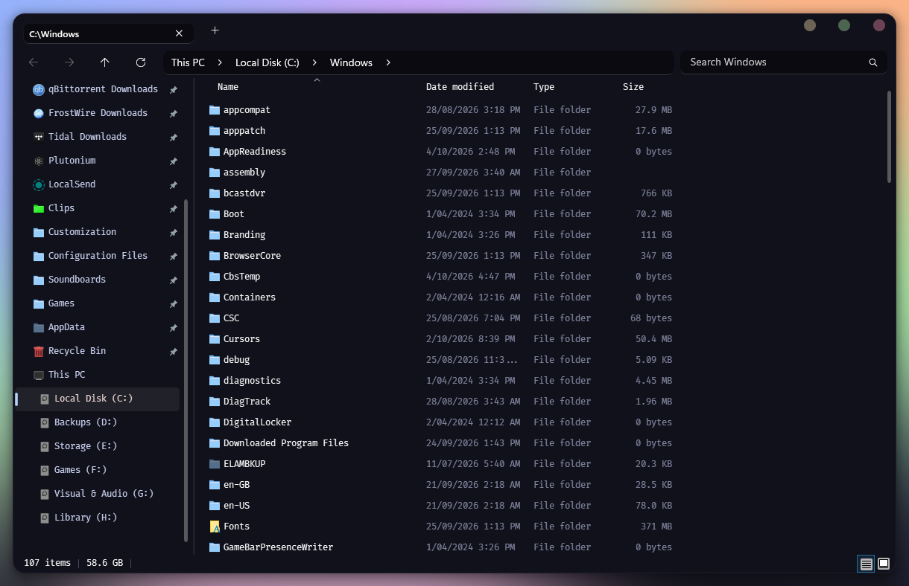 | [Shell Font Changer](mods/local/shell-font-changer) | Any font in Explorer, Start, Search and Settings, without breaking icons or emoji. |
| 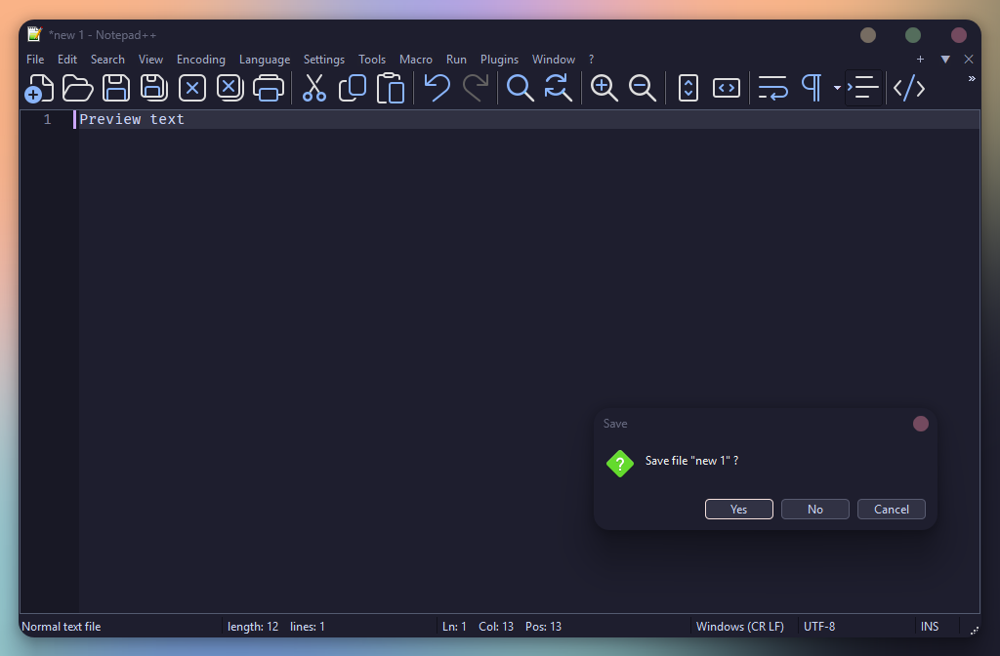 | [Notepad++ Dark Dialog Fix](mods/local/npp-taskdlg-textcolor) | Readable text in Notepad++ Save and confirm dialogs in dark mode. |

Each folder has the source, a readme and install steps. To install a mod, open
Windhawk, choose **Create a new mod**, paste the `.wh.cpp` file and compile it.
[Center Titlebar Fork](mods/local/center-titlebar-fork) is an unfinished
prototype and is not installed.

## Themes

[OnlySearch Mocha](themes/start-menu-onlysearch-mocha) cuts the Windows 11 Start
menu down to the search box and a power row, in Catppuccin Mocha with a blue
accent. Paste
[onlysearch-mocha.yaml](themes/start-menu-onlysearch-mocha/onlysearch-mocha.yaml)
into the Start Menu Styler's Textual mode.

## The full setup

| Path | What it is |
| --- | --- |
| `mods/local/` | The mods above. |
| `mods/catalog/` | Copies of the [catalog mods](https://windhawk.net/mods) in this setup, as installed. Authors, versions and licenses are in [mods/catalog/README.md](mods/catalog/README.md). |
| `settings/` | Per-mod settings, app and engine preferences. See [settings/README.md](settings/README.md). |
| `themes/` | Styler themes, ready to paste into Textual mode. |
| `mod-storage/` | Files mods wrote, currently the Taskbar Styler images. |
| `editor/` | The Windhawk mod editor's settings. |
| `manifest.json` | Every mod with version, author, license, origin and enabled state. |
| `tools/` | Scripts to apply this snapshot or rebuild it from a live install. |
| `media/` | Screenshots and previews. |

To copy the setup onto another PC:

1. Install [Windhawk](https://windhawk.net) (made with 1.7.3).
2. Install the catalog mods listed in
   [mods/catalog/README.md](mods/catalog/README.md) from Windhawk's Explore tab,
   and the mods above from their folders.
3. From an elevated shell in the repo root, preview and then apply the
   settings:

   ```powershell
   powershell -ExecutionPolicy Bypass -File tools\Apply-WindhawkSettings.ps1 -Audit
   powershell -ExecutionPolicy Bypass -File tools\Apply-WindhawkSettings.ps1
   ```

   Add `-IncludeAppSettings` to import the app and engine settings too, and
   `-RestartEngine` to restart Windhawk afterwards.
4. Copy `mod-storage/` to
   `C:\ProgramData\Windhawk\Engine\ModsWritable\mod-storage\`, and
   `editor/settings.json` to
   `C:\ProgramData\Windhawk\UIData\user-data\User\settings.json`.

Mod DLLs are not included; Windhawk compiles each mod on your machine. After
changing mods or settings, run `tools\Build-Repo.ps1` to refresh the snapshot
(`-SkipSources` refreshes settings and metadata only).

## License

My work here is MIT, see [LICENSE](LICENSE), except where a mod inherits its
original's license: Window Manager, AltSnap and Taskbar System Info Plus are
GPL-3.0, and Translucent Flyouts is LGPL-3.0. Catalog mods keep their authors'
licenses.

`settings/` holds configuration values only. Account credentials, which the
quota mods keep encrypted in their own storage, are not included.
